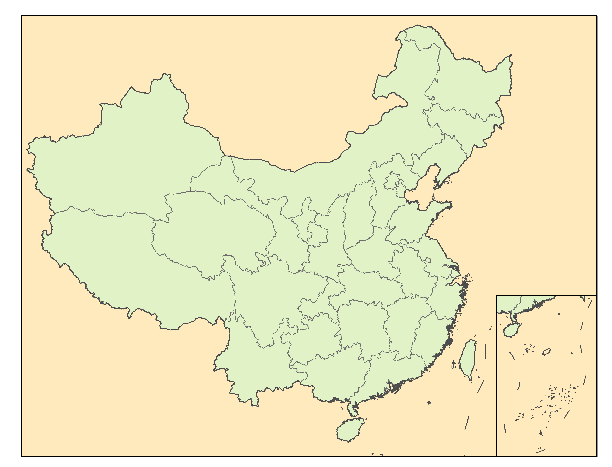
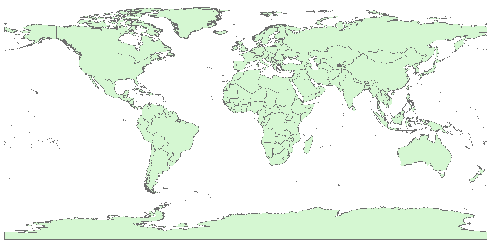
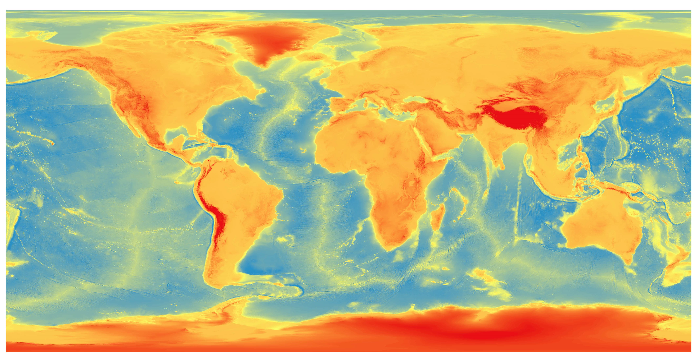
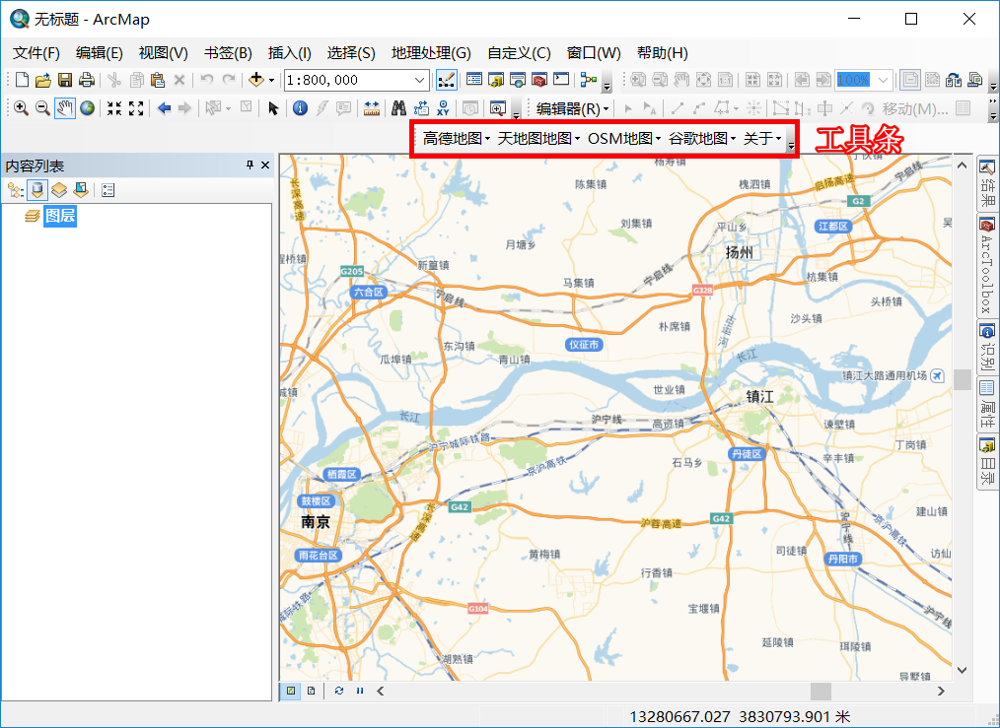

**摘要：** 地图是地理的第二语言，而ArcGIS是制作地图的重要工具。掌握ArcGIS是必要的。一方面，掌握ArcGIS是GIS专业同学的必备技能；另一方面，对于其他专业同学，掌握ArcGIS后，可以很容易地绘制研究区地理位置图、人口密度分布图等专题地图。  
本文分享GIS方面的经典书籍，介绍地理信息科学的理论知识；分享ArcGIS的书籍教程和视频教程，入门ArcGIS；分享ArcGIS安装包，配置软件环境；分享GIS数据和实用工具，方便制作地图。  
<!-- more -->
## GIS理论知识
黄杏元、马劲松编著的 **《地理信息系统概论（修订版）》**   
张康聪编著、陈健飞翻译的 **《地理信息系统导论（原著第八版）》**    

## ArcGIS教程
ArcGIS教程包括书籍教程和视频教程。  
书籍教程方面，推荐南师大汤国安老师的两本书
**《ArcGIS地理信息系统空间分析实验教程（第二版）》**
和
**《地理信息系统基础实验操作100例》**，均有pdf文档和实验练习数据，可以一边看，一边跟着操作。    
推荐先看《ArcGIS地理信息系统空间分析实验教程（第二版）》，这本书比较系统，方便我们对ArcGIS有个整体的把握。我学习ArcGIS，就是跟着这本书学的，大概花了两个星期，墙裂推荐。  
《地理信息系统基础实验操作l00例》也不错，通过100个经典的基础实验案例，详细介绍ArcGIS软件操作的具体步骤与方法。  

视频比文字更加有趣、直观、生动，所以，在B站找了两部播放量较大的视频教程，分别是《ArcGIS新手入门基础视频教程》和《ArcGIS高手进阶视频教程》。因为没有仔细看过，所以，不敢评价质量优劣。这里，列出两部视频教程，供大家参考。  

## ArcGIS安装包
提供ArcGIS 10.2的安装包、汉化包、安装教程。  
**PS:** 网盘文件夹中的ArcGIS 10.5安装包已失效，请下载ArcGIS 10.2安装包。

## GIS数据&实用工具
### 国家级400万基础地理数据  
包括国界、省界、市界、地级市点位等数据  
利用本数据集制作的中国区划图  
  

### 全球GIS数据
本资源包括以下内容：  
全球DEM数据（地形数据）及国界、省界、海岸线等矢量数据  

利用本资源的数据绘制的全球地形图   
  
利用本资源的数据绘制的全球区划图  
  

### Google Earth卫星影像下载工具  
**91位图**和**GoogleMapsDownloader**  
GoogleMapsDownloader是免费软件，缺点是只能下载到13级以及在海洋上有google水印。
如果想要下载分辨率更高的卫星影像，则需要收费。  
91位图是收费软件，将指定内容分享到5个QQ群里，可以享受免费版。本资源提供了获取免费版的方法。  

### ArcGIS加载高德、OSM和谷歌等地图
软件用途：可以在ArcGIS中加载高德地图、谷歌地图
  

## ArcGIS推荐学习路线
GIS概论的话，建议看张康聪编著、陈健飞翻译的 **《地理信息系统导论（原著第八版）》**，写得很详细；  
ArcGIS操作，建议学习南师大汤国安老师的两本书
**《ArcGIS地理信息系统空间分析实验教程（第二版）》**
和
**《地理信息系统基础实验操作100例》**；  
在使用ArcGIS工具时，遇到问题，可以参考[地理处理工具参考快速浏览](https://desktop.arcgis.com/zh-cn/arcmap/10.6/tools/main/a-quick-tour-of-geoprocessing-tool-references.htm)；  

## 资源获取途径
ArcGIS入门教程&安装包&GIS数据&使用工具  
百度网盘链接：
https://pan.baidu.com/s/1YMLUv_maGs0KNbCGo5WsJg  
提取码：kdlg  

