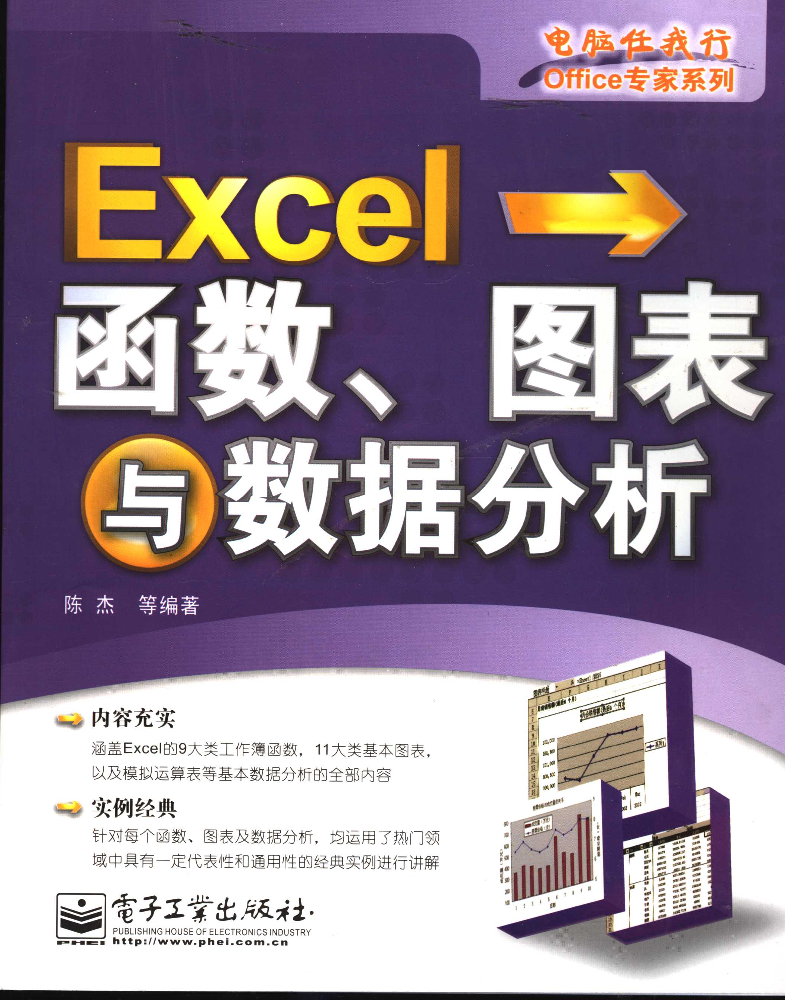
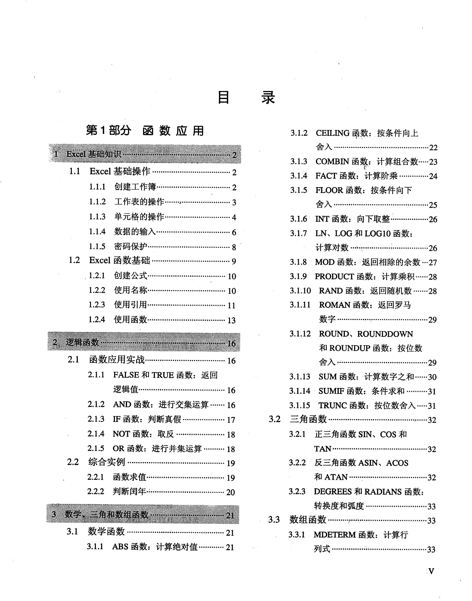

**摘要：** Excel是大家非常熟悉的软件，但是，很少有人系统地学习Excel。Excel的函数功能非常强大，系统学习Excel，可以极大地减轻工作负担。
这里推荐Excel学习资料，可供参考。
<!-- more -->
## 学习资料  
**陈杰等编著《Excel函数、图表与数据分析》**
这本书详细介绍了Excel函数，适合系统学习Excel函数，也适合作为工具书随时翻阅。

## 资料获取途径
百度网盘链接：https://pan.baidu.com/s/1wDrAE2B7qTqcyPpa1HGZwA   
提取码：09fx   
