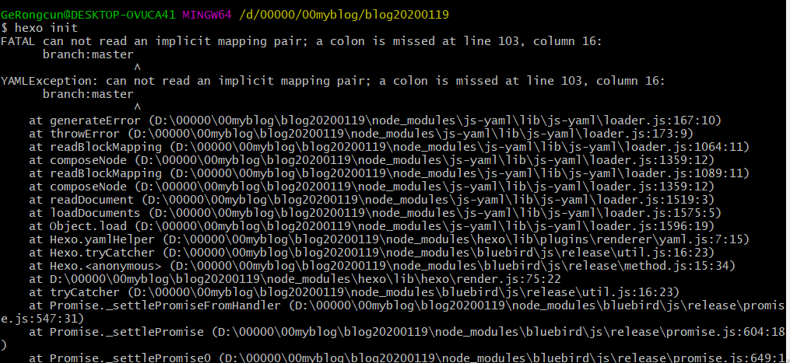
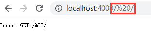
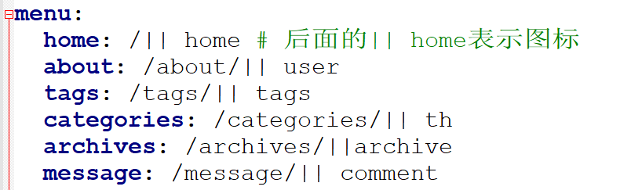
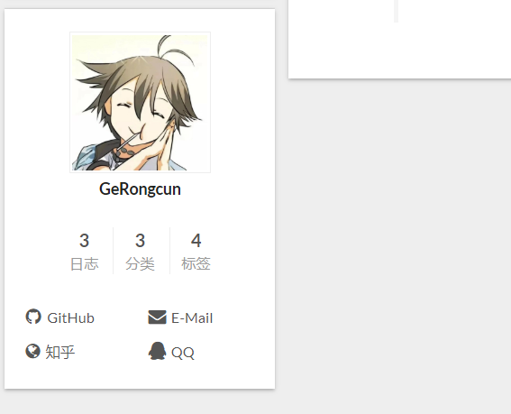
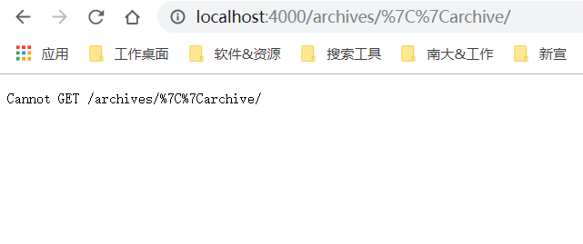

**摘要：** 前段时间，在浏览[IT侠博客](https://itxia.github.io/2018/12/24/SetupBlogWithHexo/#more)时，知道可以用Github+Hexo搭建个人博客。这几天，参考[廖雪峰老师的教程](https://www.liaoxuefeng.com/wiki/896043488029600)学习了Git，参考梧雨北辰的教程[梧雨北辰 搭建个人博客网站Github、Hexo与Next](https://www.jianshu.com/p/72842e1c63e2)和其他大佬的教程，尝试搭建个人博客。期间，遇到不少问题，在这里贴出来，避免以后再次踩坑。
<!-- more -->
个人博客，看效果进入：[https://GeRongcun.github.io](https://GeRongcun.github.io)  
Github仓库：[https://github.com/GeRongcun/GeRongcun.github.io](https://github.com/GeRongcun/GeRongcun.github.io)  

推荐学习资料：  
[Hexo官方文档](https://hexo.io/zh-cn/docs)  
[IT侠博客](https://itxia.github.io/2018/12/24/SetupBlogWithHexo/#more)  
[廖雪峰老师的Git教程](https://www.liaoxuefeng.com/wiki/896043488029600)  
[梧雨北辰 搭建个人博客网站Github、Hexo与Next](https://www.jianshu.com/p/72842e1c63e2)  
[**github+hexo搭建自己的博客网站（一）基础入门**](https://www.cnblogs.com/chengxs/p/7402174.html)  
系列教程，介绍得很全。  
[**Hexo 博客搭建**](https://blog.csdn.net/qq_36759224/category_9285510.html)  
关于 Hexo 博客搭建以及后期优化的系列教程  

-----
# 安装Hexo失败
  
**错误提示**  
```
FATAL can not read an implicit mapping pair; a colon is missed at line 103, column 16:
    branch:master
                ^
YAMLException: can not read an implicit mapping pair; a colon is missed at line 103, column 16:
    branch:master
```

**解决方法：**  
目前国内npm源有问题；所以键入如下代码即可安装成功:
npm install -g cnpm --registry=https://registry.npm.taobao.org
cnpm install hexo-cli -g

# URL乱码
## 导航栏链接URL乱码  
  
**错误原因：**%20由空格转义过来  

  
**解决方法：**只需要删除home: / || home中，/和||之间的空格。  

## 日志按钮链接URL乱码 
  
点击个人博客头像下方的“日志”按钮，跳转url出现乱码  

  
**错误原因：**%7C是由/转义过来的  

**解决方法：**
在themes\next\layout\_macro中找到sidebar.swig
```

  <div class="site-state-item site-state-posts">
  
	<a href="{{ url_for(theme.menu.archives).split('||')[0] | trim }}">
  
	<a href="{{ url_for(config.archive_dir) }}">
  
	  <span class="site-state-item-count">{{ site.posts.length }}</span>
	  <span class="site-state-item-name">{{ __('state.posts') }}</span>
	</a>
  </div>

```
将
```
<a href="{{ url_for(theme.menu.archives).split('||')[0] | trim }}">
```

修改成
```
<a href="{{ url_for(theme.menu.archives.split('||')[0]) | trim }}">
```

即可解决。

参考资料：
https://xiejavablog.ishareread.com/

# 页面中文乱码  
如果将语言设置为zh-Hans，页面中文乱码。

**错误原因：**_config.yml的默认编码为ANSI编码

**解决方法：**_config.yml的编码设置为UTF-8编码
