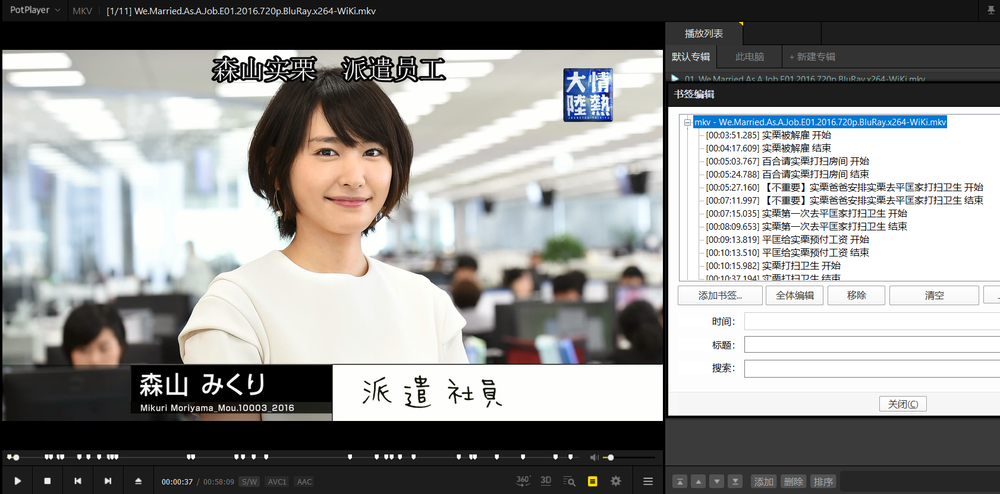

**摘要：** 利用PotPlayer播放软件记录精彩片段时间区间，借助Python+FFmpeg批量裁剪视频，实现《逃避虽可耻但有用》剧集片段批量裁剪。
<!-- more -->

## 引言

最近在看《逃避虽可耻但有用》，想把精彩片段录下来纪念。可选方案有三个，一是用录屏软件录屏；二是采用Premiere视频剪辑软件；三是采用PotPlayer播放软件+FFmpeg视频处理软件。用录屏软件录屏，非常浪费时间，直接pass；采用Premiere，边播放边剪辑，播放窗口很小，影响观看体验，不过Premiere好像可以用XML和AAF批量裁剪，我还不会；采用PotPlayer播放软件+FFmpeg视频处理软件，观看体验好，裁剪效率很高，存在的不足是PotPlayer无法显示音频波形，难以判断人物是否说完台词，较难确定剪辑出入点。  

主要步骤为两部，第一步是利用PotPlayer播放软件记录片段时间区间，第二步是借助Python+FFmpeg批量裁剪视频。话不多说，进入主题。  

## 准备工作

### 输入文件

《逃避虽可耻但有用》第一集视频文件和字幕文件  
We.Married.As.A.Job.E01.2016.720p.BluRay.x264-WiKi.mkv  
We.Married.As.A.Job.E01.2016.720p.BluRay.x264-WiKi.ass  
封装格式：mkv（Matroska）  
总体码率：4846kb/s  
分辨率：720p（1280x720）  

### PotPlayer记录片段时间区间

PotPlayer是一款卓越的播放软件，按快捷键H，调出书签编辑器；  
  
看到精彩片段，利用书签编辑器添加书签，记录片段时间区间；  
看完一整集后，点击书签编辑器的“全体编辑”按钮，复制全部书签；  
格式如下：  
```
00:03:51.285 实栗被解雇 开始
00:04:17.609 实栗被解雇 结束
00:05:03.767 百合请实栗打扫房间 开始
00:05:24.788 百合请实栗打扫房间 结束
00:05:27.160 实栗爸爸安排实栗去平匡家打扫卫生 开始
00:07:11.997 实栗爸爸安排实栗去平匡家打扫卫生 结束
00:07:15.035 实栗第一次去平匡家打扫卫生 开始
00:08:09.653 实栗第一次去平匡家打扫卫生 结束
```
奇数行表示剪辑片段入点，偶数行表示剪辑片段出点，中间的文字表示片段名称；  
将全部书签复制粘贴到txt文件夹，文件名称与视频文件名称对应，比如We.Married.As.A.Job.E01.2016.720p.BluRay.x264-WiKi.txt。  

## 借助FFmpeg批量裁剪视频

### 主要步骤

主要步骤是：  
将mkv视频文件和ass字幕文件合并为含有字幕的视频文件；  
读取txt书签，获取片段出入点，批量裁剪成精彩片段；  
在精彩片段片头添加字幕，显示片段名称，导出为含有片头字幕的精彩片段；  
将含有片头字幕的精彩片段拼合成精彩片段完整视频；  
至此，完成了精彩视频的批量剪辑；因为mkv封装格式不支持几乎所有移动设备，可能无法播放或者丢失字幕；

为了在手机上也能看视频，我们需要将mkv文件转码为mp4文件；  
单独提取精彩片段完整视频的字幕文件ass；  
单独提取精彩片段完整视频的视频文件mkv；
因为mp4封装格式不支持软字幕（mkv支持，可以选择是否显示字幕），只能将字幕文件以硬字幕方式（字幕像水印一样，无法分离出来）烧进mp4视频；

下面解释源代码文件code\.py：  

### 导入模块

```
#!/usr/bin/env python3
# -*- coding: utf-8 -*-
# 第一行注释是为了告诉Linux/OS X系统，这是一个Python可执行程序，Windows系统会忽略这个注释；
# 第二行注释是为了告诉Python解释器，按照UTF-8编码读取源代码，否则，你在源代码中写的中文输出可能会有乱码。

# ffmpy3是一个用于FFmpeg的Python包装器，最初是从ffmpy项目派生出来的。它根据提供的参数及其各自的选项编译
FFmpeg命令行，并使用Python的子进程执行它。
from ffmpy3 import FFmpeg

# 用于文件目录操作
import os

# 书签是时间，涉及时间运算
import datetime

# 打开工作文件目录
dataFolder=r"D:\0000桌面\我的笔记20200311\我的笔记20200311\00学习笔记\计算机科学\python\Python截取视频
片段笔记ffmpeg\项目文件"
os.chdir(dataFolder)

# k表示剧集的文件名
k='We.Married.As.A.Job.E04.2016.720p.BluRay.x264-WiKi'

# 合并视频和字幕，生成包含字幕的视频文件
ff = FFmpeg(global_options=['-y'],
        inputs={'{0}.ass'.format(k): None,
                '{0}.mkv'.format(k): None},
        outputs={'{0}-merge.mkv'.format(k): '-c:a copy -c:v copy -c:s copy'})
print(ff.cmd)
ff.run()

txt= open('{0}书签信息.txt'.format(k),mode='rt',encoding='UTF-8')
bookmark=txt.readlines()
txt.close()
# 读取书签信息

rows=len(bookmark)
# rows表示书签文件的行数，每两行表示片段的时间区间

txtfileStr=''
# txtfileStr记录精彩片段视频文件名称，用于拼接

# 读取书签文件，每两行裁剪视频文件，生成精彩片段文件
for i in range(0,rows,2):
    start=bookmark[i]
    # 书签文件的奇数行，表示视频剪辑入点；
    # 以i为0，进行解释
    # start=>00:03:51.285 实栗被解雇 开始

    subtitle=start[13:-4]
    # 记录精彩片段的名称
    # start[13:-4]=>实栗被解雇

    startTimeStr=start[0:start.find(" ")]
    # 获取视频剪辑入点
    # start[0:start.find(" ")]=>00:03:51.285

    startTime=datetime.datetime.strptime(startTimeStr],'%H:%M:%S.%f')
    # 将字符串转换为datetime对象，用于时间运算

    end=bookmark[i+1]
    endTimeStr=end[0:end.find(" ")]
    endTime=datetime.datetime.strptime(endTimeStr],'%H:%M:%S.%f')
    # 获取视频剪辑出点，与入点类似

    duration=endTime-startTime
    # 获得片段持续时间

    durationSecond=duration.total_seconds()
    # 将datetime对象转换为秒数

    # 利用剪辑入点和持续时间剪辑视频
    ff = FFmpeg(global_options=['-y'],
        inputs={'{0}-merge.mkv'.format(k):None},
        outputs={'{0}-{1:03d}merge.mkv'.format(k,i): '-ss {0} -t {1} -b:v 4000k -bufsize 4000k 
        -c:v libx264 -c:a copy'.format(startTimeStr,str(durationSecond))})
    print(ff.cmd)
    ff.run()
    # 这里有几个比较大的坑；
    # 一是mkv会自动加载与文件名类似的字幕文件，导致字幕显示不对，巨坑；这里，用PotPlayer选择视频自带的
    字幕即可；
    # 二是关键帧，如果不采用滤波，直接裁剪视频，会出现片头片尾卡顿，这是因为FFmpeg不能seek到非关键帧
    （具体我也不是很懂）；加上-accurate_seek参数，可以自动seek到关键帧，带来的问题是会总是以关键帧为
    出入点，视频出入点还是不准；
    # 所以，只能用滤镜，码率为4000；

    # 精彩片段片头3秒添加片段标题
    command="ffmpeg -y -i {0}-{1:03d}merge.mkv -vf drawtext=\"fontcolor=black:fontsize=50:fontfile=C:/
    Windows/fonts/msyhbd.ttc:text=\'{2}\':x=(w-text_w)/2:y=5:enable=\'between(t\,0\,3)\'\"
    -b:v 3000k -bufsize 3000k {3}-{4:03d}mergeSubtitle.mkv".format(k,i,subtitle,k,i)
    print(command)
    os.system(command)
    # 这里不会写ffmpy3模块的语法，改用命令行；前提是安装了FFmpeg.exe；

    txtfileStr=txtfileStr+'file '+'\'{0}-{1:03d}mergeSubtitle.mkv\'\n'.format(k,i)
    # 将精彩片段的文件名记录下来，用于拼接

将精彩片段的文件名写入txt文件
a= open('file.txt','w')
a.write(txtfileStr)
a.close()

# 拼接精彩片段
ff = FFmpeg(global_options=['-f','concat -safe 0'],
        inputs={'file.txt':None},
        outputs={'{0}-clip.mkv'.format(k):'-c:a copy -c:v copy -c:s copy'})
print(ff.cmd)
ff.run()

# 至此，完成了精彩视频的批量剪辑；下面，为了在手机上也能看视频，我们需要将mkv文件转码为mp4文件

# 仅提取视频、音频，删除字幕
command="ffmpeg -i {0}-clip.mkv -map 0:0 -map 0:1 -c:a copy -c:v copy {0}-clipNotSubtitle.mkv"
.format(k,k)
print(command)
os.system(command)

# 提取字幕文件
command="ffmpeg -i {0}-clip.mkv -an -vn -scodec copy {0}-clip.ass".format(k,k)
print(command)
os.system(command)

# 将字幕以硬字幕形式烧进视频
# 可以调整码率和分辨率

# 不调整分辨率，码率3000
# command="ffmpeg -i {0}-clipNotSubtitle.mp4 -c copy -vf subtitles={0}-ass.ass {0}-clipSubtitle
.mp4".format(k,k,k)

# 不调整分辨率，码率2000
command="ffmpeg -i {0}-clipNotSubtitle.mkv -vf subtitles=\'{0}-clip.ass\' -b:v 2000k 
-bufsize 2000k {0}-clipSubtitle.mp4".format(k,k,k)

# 这里有坑，调整分辨率和内嵌字幕的顺序谁先谁后；内嵌字幕在先，成果视频没有字幕，必须把内嵌字幕放在后面

# 调整分辨率640x480，码率1000
command="ffmpeg -i {0}-clipNotSubtitle.mkv -s 640x480 -vf subtitles=\'{0}-clip.ass\' 
-b:v 1000k -bufsize 1000k {0}-clipSubtitle.mp4".format(k,k,k)

# 等比例调整分辨率，视频宽高变成原来的1/2
# command="ffmpeg -i {0}-clipNotSubtitle.mkv -vf scale=iw/2:ih/2 -vf subtitles=\'{0}-clip.ass\' -b:v 1000k 
-bufsize 1000k {0}-clipSubtitle.mp4".format(k,k,k)

# 等比例缩放至480i
# command="ffmpeg -i {0}-clipNotSubtitle.mkv -vf scale=480:-1 -vf subtitles=\'{0}-clip.ass\' -b:v 1000k 
-bufsize 1000k {0}-clipSubtitle.mp4".format(k,k,k)
# 等比例缩放至480p
command="ffmpeg -i {0}-clipNotSubtitle.mkv -vf subtitles=\'{0}-clip.ass\' -b:v 1000k 
-bufsize 1000k -vf scale=-1:480 {0}-clipSubtitle.mp4".format(k,k,k)
# 等比例缩放时，会报错width not divisible by 2 (853x480)
# 宽度必须是2的倍数

# 等比例缩放至480p，不报错
# 处理方式有两种，一是指定宽高
command="ffmpeg -i {0}-clipNotSubtitle.mkv -vf scale=854:480 -vf subtitles=\'{0}-clip.ass\' -b:v 1000k 
-bufsize 1000k {0}-clipSubtitle.mp4".format(k,k,k)
print(command)

# 二是用trunc
# trunc类似于int取整
command="ffmpeg -i {0}-clipNotSubtitle.mkv -vf scale=trunc(480*iw/ih/2)*2:480 -vf subtitles=\'{0}-clip.ass\' -b:v 1500k 
-bufsize 1500k {0}-clipSubtitle.mp4".format(k,k,k)
os.system(command)

至此，我们完成了从mkv到mp4的转码。
```
