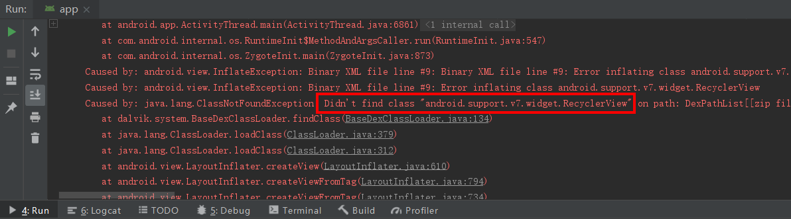
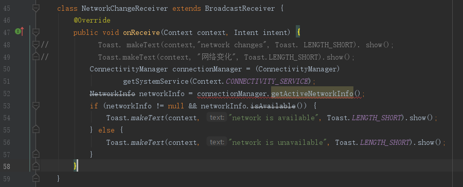
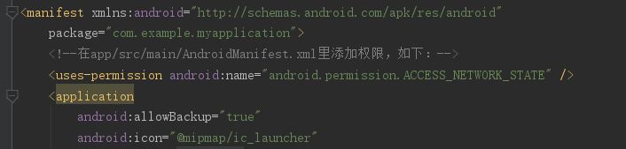
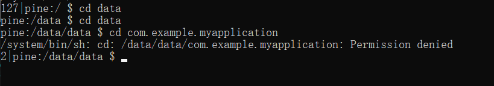
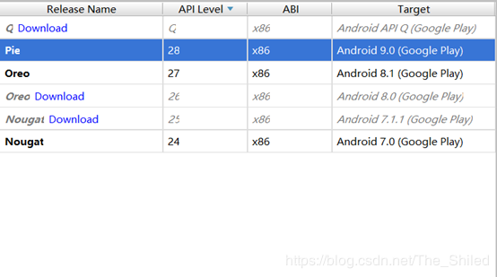
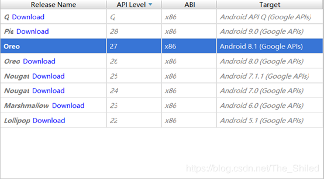
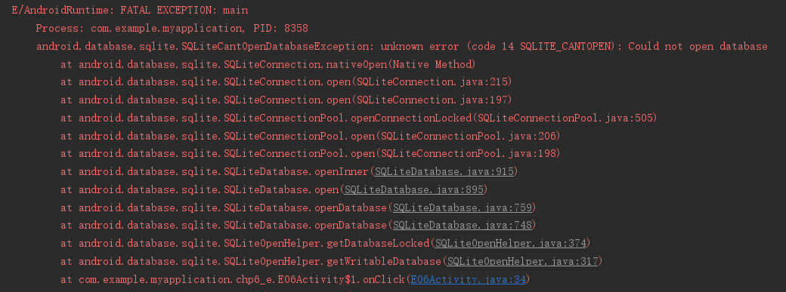

# 前言
在学习郭霖大神《第一行代码——Android 第2版》（成书于2016年）过程中，因为代码过时，导致程序无法运行，耽误了很多时间，这里贴出我遇到的过时代码及更新写法。

# 过时代码及更新写法
## 3.6 更强大的滚动控件——RecyclerView
**位置**  
第3章 软件也要拼脸蛋——UI开发的点点滴滴  
3.6 更强大的滚动控件——RecyclerView  

**运行错误提示**  
  
  
显示java.lang.ClassNotFoundException: Didn't find class "android.support.v7.widget.RecyclerView"  

**代码更新写法**  
参考资料：[一次解决找不到 android.support.v7.XXX 问题](https://blog.csdn.net/u011041494/article/details/93849730)  
在build.gradle中用
```
implementation 'androidx.recyclerview:recyclerview:1.0.0'
```
替换
```
implementation 'com.android.support:recyclerview-v7:x.x.x'
```

并在xml文件中用
```
<androidx.recyclerview.widget.RecyclerView
        ...>
</androidx.recyclerview.widget.RecyclerView>
```
替换对应组件标签
```
<android.support.v7.widget.RecyclerView
        ...>
</android.support.v7.widget.RecyclerView>
```
由于Androidx中是对于support包的整合升级，可能还需要修改组件相应代码，如recyclerView组件中，若使用还需要在Activity/fragment的代码中修改
```
manager.setOrientation(LinearLayoutManager.VERTICAL);
```
的参数 LinearLayoutManager.VERTICAL为RecyclerView.VERTICAL

## 5.2.1 动态注册监听网络变化
**位置**  
第5章 全局大喇叭——详解广播机制  
5.2.1 动态注册监听网络变化  

**运行错误提示**  

  
显示'android.net.Networklnfo' is deprecated（被弃用了）   

**代码更新写法**  
参考资料：  
[Android 7.0 监听网络变化的示例代码](https://www.jb51.net/article/136923.htm)  
[各种网络状态的解释](https://blog.csdn.net/u011315960/article/details/79006162)  
[ConnectivityManager.NetworkCallback官网文档](https://developer.android.google.cn/reference/android/net/ConnectivityManager.NetworkCallback.html)

AndroidManifest.xml添加权限
 
```
<!--在app/src/main/AndroidManifest.xml里添加权限，如下：-->
<uses-permission android:name="android.permission.ACCESS_NETWORK_STATE" />
```

Activity活动文件代码如下：
```
public class D02Activity extends AABaseActivity {

    private static final String TAG = "D02Activity";
    
    private ConnectivityManager.NetworkCallback networkCallback;
    private ConnectivityManager connectivityManager;
    @Override
    protected void onCreate(Bundle savedInstanceState) {
        super.onCreate(savedInstanceState);
        setContentView(R.layout.activity_d02);

        networkCallback = new NetworkCallbackImpl();
        NetworkRequest.Builder builder = new NetworkRequest.Builder();
        NetworkRequest request = builder.build();
        connectivityManager = (ConnectivityManager) getSystemService(Context.CONNECTIVITY_SERVICE);
        connectivityManager.registerNetworkCallback(request, networkCallback);
    }

    @Override
    protected void onDestroy() {
        super.onDestroy();
        connectivityManager.unregisterNetworkCallback(networkCallback);
//        取消注册广播接收器
        Log.d(TAG, "onDestroy: 取消注册");
    }

    private class NetworkCallbackImpl extends ConnectivityManager.NetworkCallback {
        @Override
        public void onAvailable(Network network) {
            super.onAvailable(network);
            Toast.makeText(getBaseContext(), "onAvailable", Toast.LENGTH_SHORT).show();
//            有网
//            网络可用的回调
            Log.d(TAG, "onAvailable: 连接网络");
        }

        @Override
        public void onLosing(Network network, int maxMsToLive) {
            super.onLosing(network, maxMsToLive);
            Toast.makeText(getBaseContext(), "onLosing", Toast.LENGTH_SHORT).show();
//            Called when the network is about to be disconnected.
//            正在取消连接
//            在网络失去连接的时候回调，但是如果是一个生硬的断开，他可能不回调
//            手动关闭网络，没有onLosing的回调，只看到了onLost，说明我们手动关闭网络连接是一个很粗暴的行为，就像官方注释上写的，如果是一个生硬的断开，他可能不回调。
            Log.d(TAG, "onLosing: 正在失去连接");
        }

        @Override
        public void onLost(Network network) {
            super.onLost(network);
            Toast.makeText(getBaseContext(), "onLost", Toast.LENGTH_SHORT).show();
//            Called when the framework has a hard loss of the network or when the graceful failure ends.
//            断网
//            网络丢失的回调
            Log.d(TAG, "onLost: 失去网络");
        }

        @Override
        public void onCapabilitiesChanged(Network network, NetworkCapabilities networkCapabilities) {
            super.onCapabilitiesChanged(network, networkCapabilities);
            Toast.makeText(getBaseContext(), "onCapabilitiesChanged", Toast.LENGTH_SHORT).show();
            Log.d(TAG, "onCapabilitiesChanged: ");
//            Called when the network the framework connected to for this request changes capabilities but still satisfies the stated need.
//            过一段时间就会响应一次
            Log.d(TAG, "onCapabilitiesChanged: 设置改变");
        }

        @Override
        public void onLinkPropertiesChanged(Network network, LinkProperties linkProperties) {
            super.onLinkPropertiesChanged(network, linkProperties);
            Toast.makeText(getBaseContext(), "onLinkPropertiesChanged", Toast.LENGTH_SHORT).show();
            Log.d(TAG, "onLinkPropertiesChanged: 连接改变");
        }
        @Override
        public void onUnavailable() {
            super.onUnavailable();
            Toast.makeText(getBaseContext(), "onUnavailable", Toast.LENGTH_SHORT).show();
//            按照官方注释的解释，是指如果在超时时间内都没有找到可用的网络时进行回调
            Log.d(TAG, "onUnavailable: 连接超时");
        }
//手动打开网络的回调就比较多了，首先是onAvailable，显示网络可用，然后是onCapabilitiesChanged
// ，说此时网络的连接能力发生了第一次变化，估计是连接中把，再然后是onLinkPropertiesChanged，说明连接的属性已经发生了变化，此时应该获得了ip地址等信息，最后又回调了onCapabilitiesChanged，那么应该是网络进度到可用的状态。

    }
}
```
## 5.2.2 静态注册实现开机启动
**位置**  
第5章 全局大喇叭——详解广播机制  
5.2.2 静态注册实现开机启动   
5.3.1 发送标准广播  

**运行错误提示**  
程序运行失败，Toast没有弹出。  

**错误原因**  
无法静态注册广播接收器；
在Android 8.0及以上的平台上，应用不能对大部分的广播进行静态注册，也就是说，不能在AndroidManifest文件对有些广播进行静态注册，这里必须强调是有些广播，因为有些广播还是能够注册的。   

谷歌在8.0后为了提高效率，删除了静态注册，防止关闭App后广播还在， 造成内存泄漏， 现在静态注册的广播需要指定包名，而动态注册就没有这个问题。 

由于 Android 8.0 引入了新的广播接收器限制，因此您应该移除所有为隐式广播 Intent 注册的广播接收器。将它们留在原位并不会在构建时或运行时令应用失效，但当应用运行在 Android 8.0 上时它们不起任何作用。显式广播 Intent（只有您的应用可以响应的 Intent）在 Android 8.0 上仍以相同方式工作。这个新增限制有一些例外情况。如需查看在以 Android 8.0 为目标平台的应用中仍然有效的隐式广播的列表，请参阅隐式广播例外。    

参考资料：  
https://blog.csdn.net/qq_32425789/article/details/83655957   
https://blog.csdn.net/chuyouyinghe/article/details/79424373  
https://www.cnblogs.com/hustcser/p/9754930.html  


**代码更新写法**  
参考资料：  
[Android 8.0 静态广播无法接收](https://www.jianshu.com/p/984a128f5463)   
[Android8.0 下的静态广播](https://blog.csdn.net/wodenidejingaide/article/details/80505211)  

推荐使用动态广播registerReceiver注册形式,这个不受限制

**5.2.2静态注册实现开机启动**  
没有找到解决办法。   

**5.3.1发送标准广播**  
Activity活动文件中点击按钮的响应代码如下：  
```
Button button1 = (Button) findViewById(R.id.Button_D03_01);
button1.setOnClickListener(new View.OnClickListener() {
    @Override
    public void onClick(View v) {
        Log.d(TAG, "onClick: 点击按钮");
        Intent intent = new Intent("com.example.myapplication.MY_BROADCAST");
        intent.setComponent(new ComponentName(D03Activity.this, GercBroadcastReceiver.class));
        sendBroadcast(intent);
```

## 6.2.1 将数据存储到文件中
**位置**  
第6章 数据存储全方案——详解持久化技术   
6.2.1 将数据存储到文件中

**运行错误提示**  
找不到Android Device Monitor。

**错误原因**  
随着android ide的升级，之前的一些调试工具逐渐废弃并被新的工具替代。之前大部分的调试工具都位于Android Device Monitor中，该工具集在android studio 3.1中被废弃并在android studio 3.2中被移除。  

参考资料：  
[Android Device Monitor官方替代工具](https://blog.csdn.net/w_xue/article/details/88649081)

**代码更新写法**  
参考资料：  
[android studio 3.0以上版本Android Device Monitor的替代方案](https://blog.csdn.net/baidu_34635864/article/details/90902017)  

Android Studio界面右下角有Device File Explorer按钮，点击后，弹出Device File Explorer界面，可以找到/data/data/\<package name\>/files/data，然后导出。  

## 6.4.1 创建数据库
**位置**  
第6章 数据存储全方案——详解持久化技术   
6.4.1 创建数据库

### Permission denied没有权限
**运行错误提示**  
在命令行窗口，执行命令cd \<package name\>，显示Permission denied没有权限。
  
**错误原因**   
手机没有获得root权限。   

**解决方法**   
方法一：

真机测试，手机获取root权限后，输入su root，申请root权限，然后手机上点击授权，再次执行cd data/data即可进入手机data/data目录。  
参考资料：  
[windows 下通过adb shell进入data目录，Permission denied 权限被拒绝](https://blog.csdn.net/xiejc01/article/details/8449935?utm_source=blogxgwz0)  

方法二：  
真机获得root权限的步骤比较复杂，建议安装虚拟机。点击“AVD Manager”按钮，创建虚拟机。  
安装虚拟机后，输入su root，显示“su: not found”问题。
我们获取不了管理员权限都是因为下载的虚拟机中Target带(Google play)，是无法获取管理员权限的。  
   

然后重新下载一个Target带（Google APIs）的虚拟机,是可以获取管理员权限的。  
   

参考资料：  
[关于解决su:not found的方法](https://blog.csdn.net/the_shiled/article/details/91044129)

### 无法打开数据库
**运行错误提示**   
无法打开数据库。
android.database.sqlite.SQLiteCantOpenDatabaseException: unknown error (code 14 SQLITE_CANTOPEN): Could not open database
   

**错误原因**   
Android6.0以后出现了很多权限即使在AndroidManifest.xml中配置了也不行，必须手动请求，或者在设置-应用-权限打开对应的权限。
换成Android 4.0系统运行，直接就运行起来了。    
自Android 6.0开始，Google开始对系统权限做出严格的要求，有些权限必须用户同意才能调用相应功能，所以开发者需要调用权限申请的代码，弹出一个小窗口，向用户动态申请权限。  

参考资料：  
[unknown error (Sqlite code 14): Could not open database解决方案](https://blog.csdn.net/qq_31796651/article/details/70155155)  
[Android 6.0以上动态申请文件读写权限](https://blog.csdn.net/qq_34330286/article/details/79660059)  
[Android的单个或多个权限动态申请](https://blog.csdn.net/qq_33200967/article/details/81041390)  


**解决方法**   


# Android学习资料汇总
郭霖《第一行代码——Android 第2版》   
[Android开发相关的Blog推荐——跟随大神的脚步才能成长为大神](https://blog.csdn.net/zhaokaiqiang1992/article/details/43731967)
