## 前言  
今天聊聊苏北重镇盐城。  
我是盐城人，我给自己袋盐！  

## 位置特殊
### “盐城”的由来
盐城盐城，煮海为盐。环城皆盐场，故名“盐城”。盐城在中国地图上非常好辨别，在江苏海岸线上有凸起的小角。   
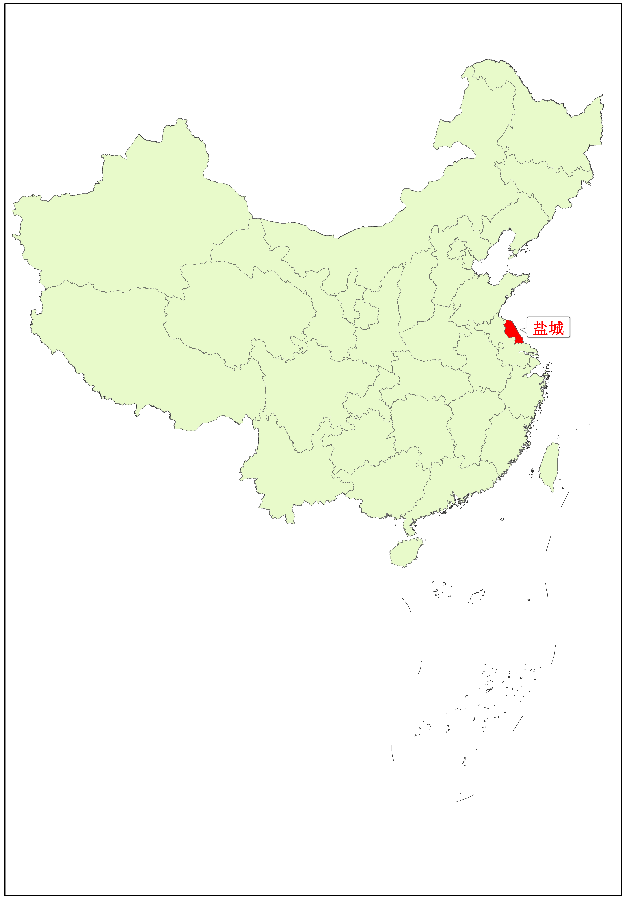  
▲盐城在中国的位置  
### 淮河入海口
盐城是淮河入海口之一，位于南北分界线。  
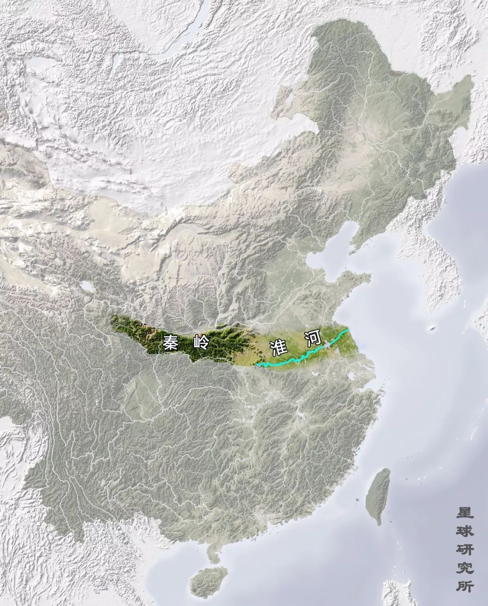  
▲秦岭-淮河一线  
图片来源：星球研究所  
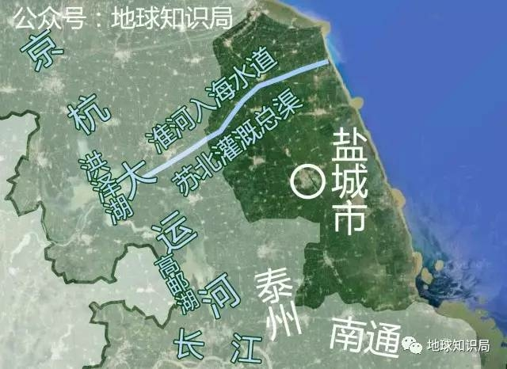   
▲淮河入海水道  
来源：地球知识局   
### 黄淮海平原
盐城位于黄淮海平原和长江中下游平原过渡带，是江苏省面积最大、海岸线最长的地级市。   
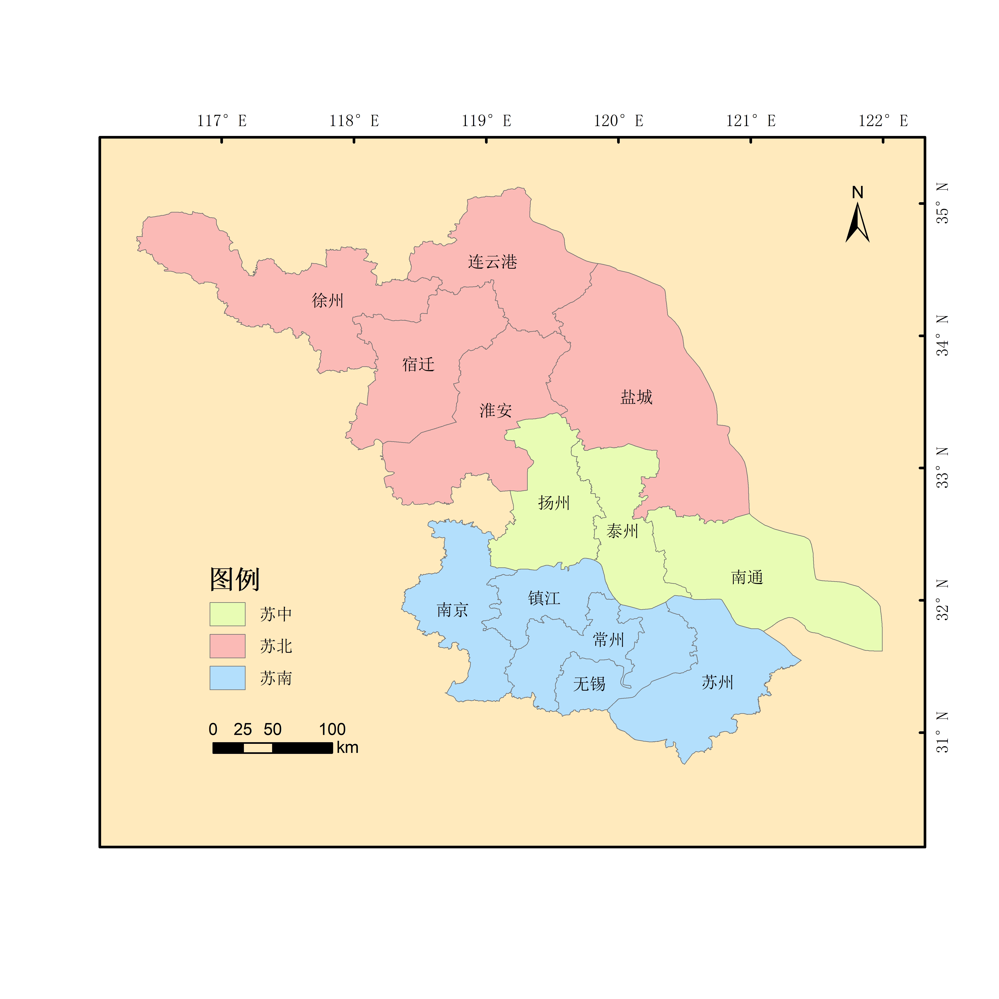  
▲盐城在江苏省的位置  
### 唯一一座没有山的地级市
盐城是唯一一座没有山的地级市，是黄河、淮河、长江冲积形成的冲积平原。黄河曾在此入海，如今已经废弃，称为“废黄河口”。
   
▲盐城卫星影像图 
### 百河之城，鱼米之乡
盐城是百河之城，鱼米之乡。
上海在盐城大丰区拥有300平方千米飞地，包括上海农场、海丰农场、川东农场，是上海重要的“米袋子”、“菜篮子”和“肉盘子”。 
飞地：隶属于某一行政区管辖但不与本区毗连的土地。

## 风景如画
### 盐城——一个让人打开心扉的地方 
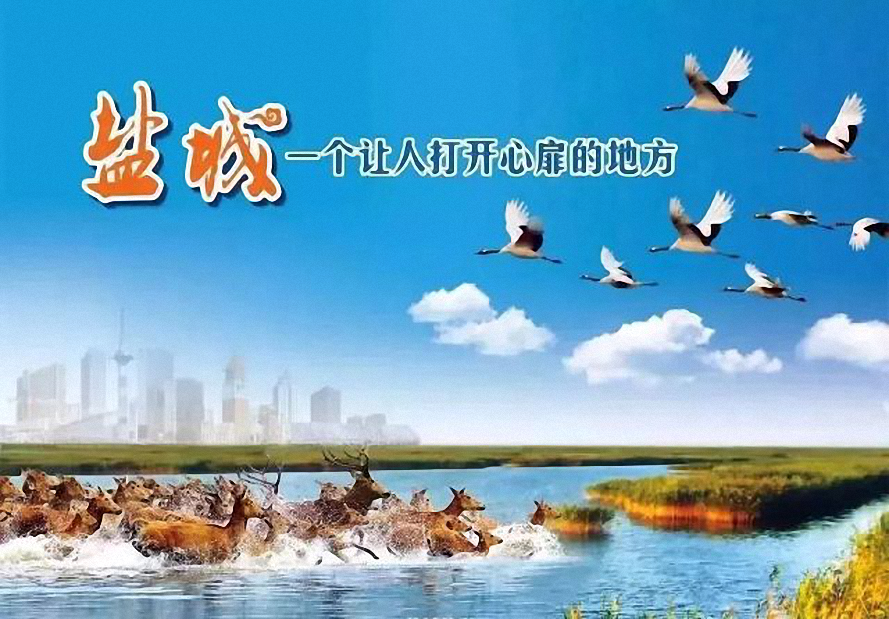   
▲盐城宣传画 

### 江苏省2/3的国家级自然保护区
拥有江苏省2/3的国家级自然保护区：盐城沿海滩涂珍禽国家级自然保护区（丹顶鹤）和大丰麋鹿国家级自然保护区（麋鹿）。江苏还有一个保护区是泗洪洪泽湖湿地国家级自然保护区。 

### 太平洋西岸最大、最完好的滩涂湿地
盐城沿海滩涂面积683万亩，并以每年5万亩的成陆速度增长。拥有太平洋西岸最大、最完好的滩涂湿地。 
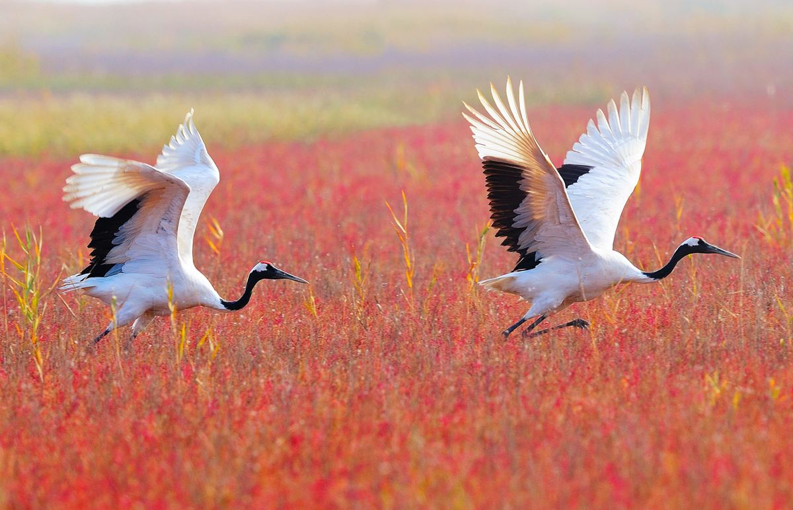  
▲丹顶鹤 
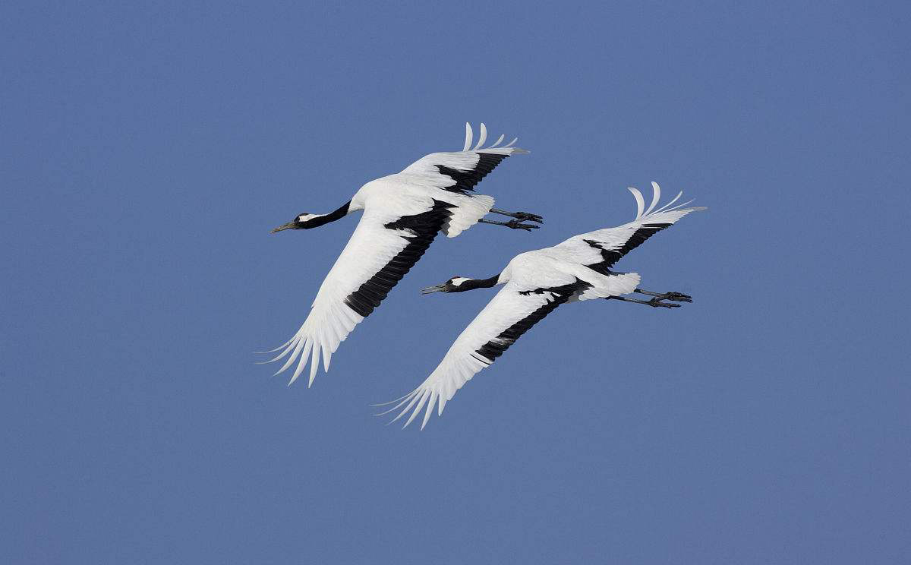  
▲丹顶鹤   
丹顶鹤是候鸟。每年的11月份到次年的3月份，黑龙江扎龙等地的丹顶鹤来此越冬。     
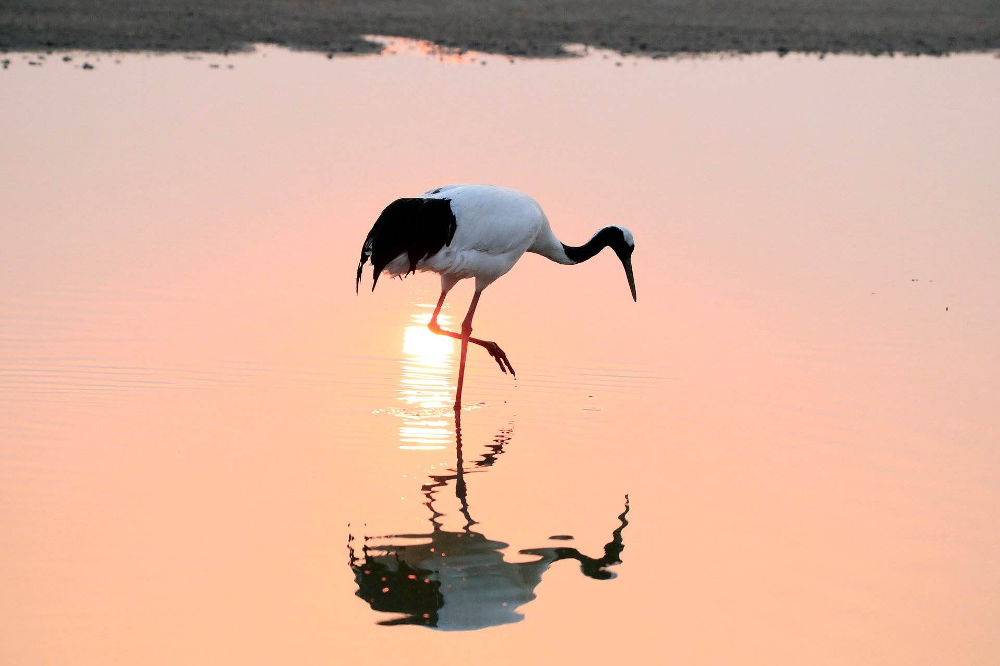  
▲丹顶鹤   

### “东方湿地之都，仙鹤神鹿世界” 
仙鹤：丹顶鹤（一般而言，”鹤“、”仙鹤“均指丹顶鹤）   
神鹿：麋鹿（四不像，姜子牙坐骑）。   
四不像：脸似马非马、角似鹿非鹿、蹄似牛非牛、尾似驴非驴。   
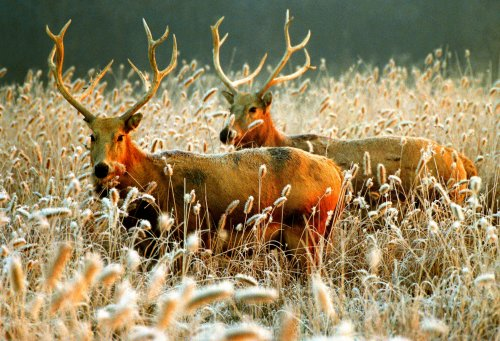  
▲麋鹿 
  
▲麋鹿 
### 中国第一位驯鹤姑娘。
徐秀娟出生于养鹤世家，离开扎龙，远赴盐城，援助丹顶鹤保护事业。在找寻走失丹顶鹤时，不幸溺水身亡，年仅23岁。  
歌曲《一个真实的故事》，即是为了纪念她。  

## 革命老区
皖南事变后，新四军在盐城重建军部。  
拥有全国唯一的专业性新四军纪念馆。
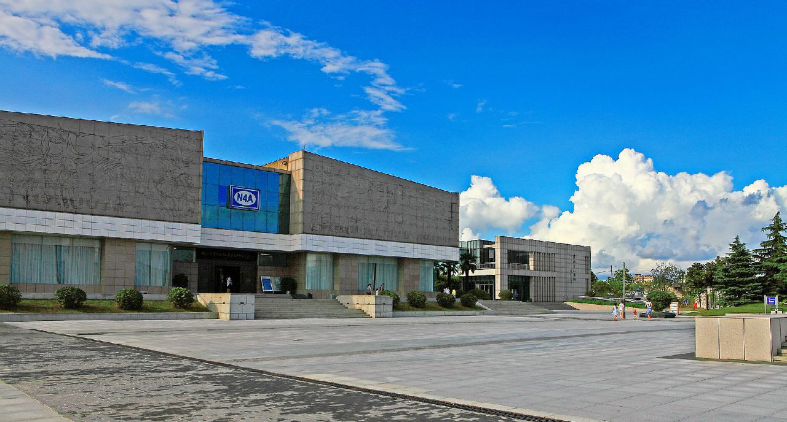 
▲新四军纪念馆  
N4A：New 4 Army  
革命老区，全国双拥模范城市（拥政爱民，拥军优属）。  
市中心核心地段是建军路和解放路交界处，坐落着“大铜马”（新四军重建军部纪念塔）。它是盐城最显著的城市地标与精神象征。  
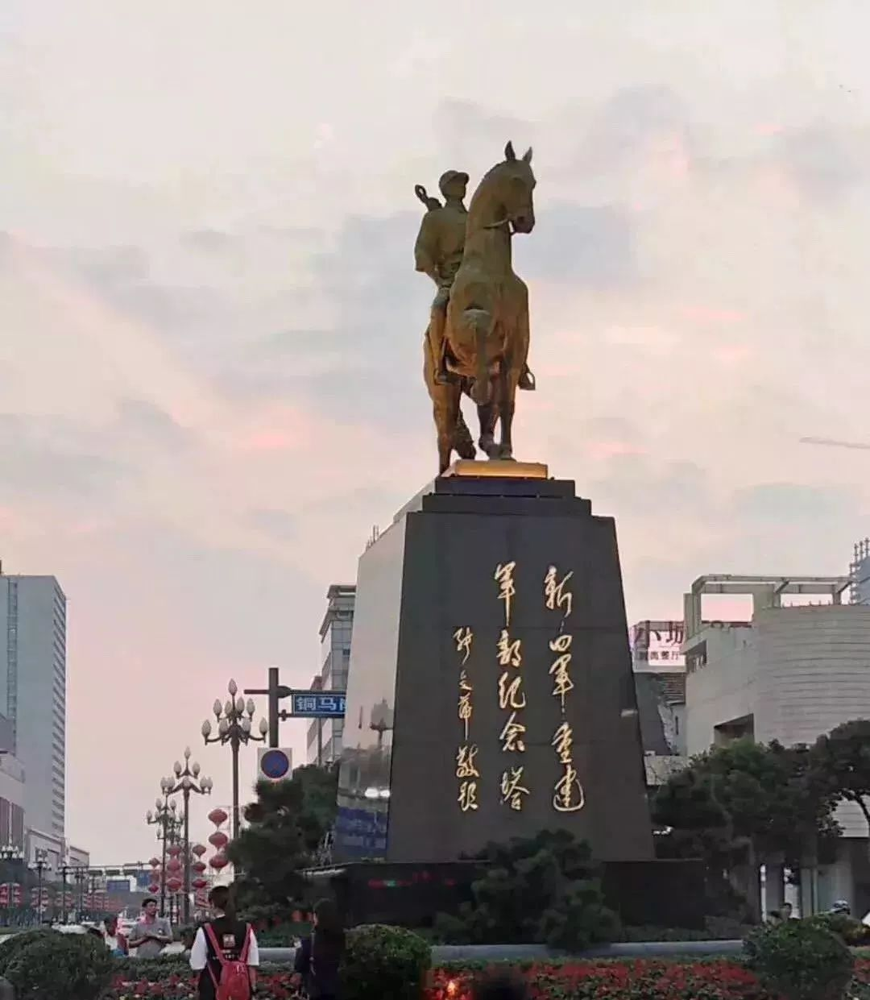   
▲新四军重建军部纪念塔    
原新四军第四师师长、原国务院副总理张爱萍将军亲笔题词

## 经济发达
盐城面积1.69万平方千米，人口724万（2018年数据）。  
2018年，盐城GDP5487亿元，在全国约300座城市中，排名36位，江苏第七，苏北第二（苏北第一是徐州）。  
拥有江苏最大的汽车制造企业——东风悦达·起亚（中韩合资）。  
   
▲东风悦达·起亚Logo  
东风集团，中国四大汽车集团之一。  
悦达集团，江苏长江以北最大的国有企业。  
起亚集团，韩国最早的汽车制造商，世界产量第五大的汽车生产商。  
   
▲起亚汽车Logo  

## 人才辈出
### 锦鲤女孩杨超越
   
▲锦鲤女孩杨超越
### 外交部部长乔冠华
外交部部长乔冠华。1971年10月，中国重返联合国。11月，乔冠华率中国代表团首次参加26届联合国代表大会。乔冠华激动之情难以言表，遂仰天大笑。这一情景被记者拍下，被称为“乔的笑”，获普利策奖。  
   
▲“乔的笑”
### 毛泽东秘书胡乔木
“中共中央第一支笔”、毛泽东秘书胡乔木。  
### 国民党一级上将郝柏村
国民党一级上将、原台湾当局“行政院长”郝柏村。  
### 儿童文学作家曹文轩
儿童文学作家曹文轩，著有《草房子》，获”国际安徒生奖“。
  
▲曹文轩

## 旅游景点
### 盐城行政区划
盐城下辖3区5县1市，面积1.69万平方千米，人口724万（2018年数据）。
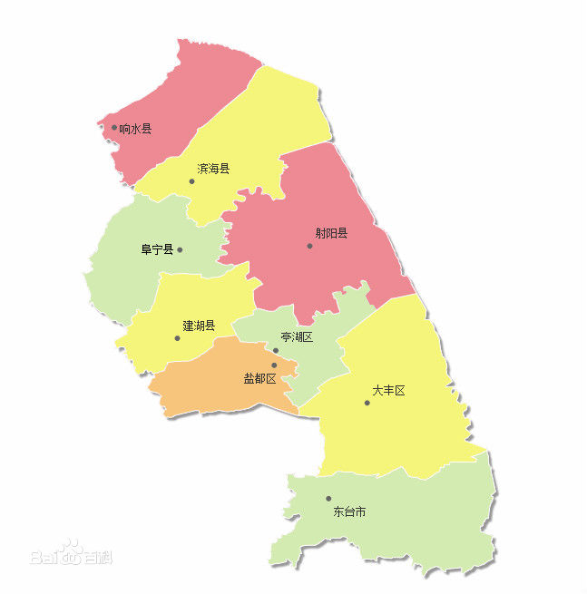  
▲盐城市行政区划图
### 亭湖区（市中心）
新四军纪念馆  
盐城海盐历史文化景区（盐渎公园、中国海盐博物馆、盐镇水街）  
盐城人民公园  
特产：步凤猪头肉、伍佑醉螺、伍佑糖麻花、盐城鸡蛋饼等。  

### 大丰区
5A级景区中华麋鹿园（江苏大丰麋鹿国家级自然保护区）  
大丰中华水浒园（施耐庵写作《水浒传》的地方）  
大丰梦幻迷宫（游乐场性质）  
大丰港海洋世界（海洋科技馆、海洋水族馆、海洋植物馆等）  
大丰荷兰花海（种植七大类花卉计100多万株）  
上海知青纪念馆  
梅花湾（5000多株梅树、400多盆梅花盆景）  
特产：海丰大米、大丰东沙紫菜、宝龙龙虾等。  

### 射阳县
江苏盐城湿地珍禽国家级自然保护区（11月至次年3月，丹顶鹤来此越冬）  
十里菊香景区（菊花种植面积4万亩，为全国之最，是华东地区最大的中药材种植基地）  
特产：射阳大米、盐城海盐、洋马菊花等。  

### 阜宁县
淮剧之乡、杂技之乡  
金沙湖旅游景区（中国最大的淡水沙滩浴场、华东地区唯一的欢乐滑沙场、长三角地区最大的沙雕艺术园、江苏最大的冰雪梦幻王国）  
新四军军部旧址停翅港  
特产：阜宁大糕、阜宁大米、阜宁西瓜、阜宁戚桥茶干等。  

### 东台市
江苏省计划单列市、“黄海明珠”  
东台市西溪旅游文化景区（董永七仙女文化园、西溪古城、海春塔苑、西溪植物园）  
江苏黄海海滨国家森林公园（东台沿海是联合国教科文组织认定的太平洋西岸唯一未被污染的海滨圣地）  
安丰古镇  
特产：东台鱼汤面、东台陈皮酒、东台西瓜、东台发绣、东台蚕茧、东台羽扇、东台木雕、四鳃鲈鱼等。  

### 建湖县
九龙口景区  
特产：建湖大米、建湖藕粉圆子、建湖烟花、建湖草鸡、建湖青虾、溏心皮蛋（松花蛋）、九龙口大闸蟹等。  

### 滨海县
通榆河枢纽风景区  
特产：滨海香肠、滨海猪头肉、滨海白首乌、滨海彩塑等。  

### 盐都区
大纵湖  
特产：秦南水牛肉、葛武嫩姜片、大纵湖醉蟹、纵湖大闸蟹、龙冈茌梨等。  

### 响水县
浅水藕之乡  
特产：响水浅水藕等。  

## 拓展阅读
[【地球知识局】江苏和山东，谁被黄河祸害得最惨？](https://mp.weixin.qq.com/s?src=11&timestamp=1554900893&ver=1538&signature=5pv5808LPx5UvAKho04lCx7t-qpz2elgnxc11WuvBrA99q-17gOBnxGoZAeUVP-DnQJ6iSOcfmIfLgwqzVz8HmIIaMPW9bVJx827-swpxbFg4bjJjd51rH6WR31ykpUn&new=1)  
[【地球知识局】江浙沪是黄河冲出来的么？](https://mp.weixin.qq.com/s?src=11&timestamp=1554900761&ver=1538&signature=5pv5808LPx5UvAKho04lCx7t-qpz2elgnxc11WuvBrAKXW1cA2lKOgk5cz95biWjDEgdpvcBvEljceMz-mzRGBV7gCuMeaT1MoCXKUVigQcuVqAk0pOx*3qlduD1QN2g&new=1)  
[【地球知识局】先富如何带后富，苏北何时修铁路？](https://mp.weixin.qq.com/s?src=11&timestamp=1554900761&ver=1538&signature=5pv5808LPx5UvAKho04lCx7t-qpz2elgnxc11WuvBrDMhUPj8laHkXIi8ZT0Q4yUKHxBzDSDT9hVSpzqxaOe7v8AceICdK4udjbpfQxf6AASoXs6raQRcq42YTFfXnSQ&new=1)  
[盐城特产目录](http://shop.bytravel.cn/produce/food/index374_list.html)  
[盐城官方宣传片](https://www.bilibili.com/video/av48835603)  