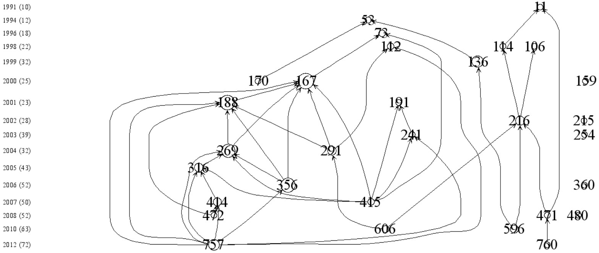

## 前言
如何从浩瀚的文献数据库中找到关键文献，是广大科研人员普遍面临的难题。在此背景下，大量的**引文分析软件**应运而生。CiteSpace、HistCite、VOSviewer等软件是其中的佼佼者。

## HistCite
### 简介
HistCite是由“SCI之父”尤金·加菲尔德和他的同事们开发的引文编年可视化软件。软件名称是“History of Cite”的简写，意为引文历史。它是一款非常强大的引文分析工具，可以快速绘制出某个研究领域的发展脉络，快速锁定某个研究方向的重要文献和学术大牛，还可以找到某些具有开创性成果的无指定关键词的论文！

HistCite为科睿唯安的一款产品，Histcite的引文数据目前只能来源于WOS(Web of Science)核心合集。目前，HistCite这款软件已经停止更新了。

### 主要功能
A、理出一个领域的发展脉络
B、快速定位某个领域的重要文献
C、查找领域的重要科学家和机构
D、总结某个领域的最新进展
E、找出无指定关键词的重要文献

### HistCite Pro
中国科学技术大学的王庆学长在Histcite基础上开发了HistCite Pro，延续了软件的生命。  
王庆学长，知乎账号：Tsing；微信公众号：科研利器。  

### 使用教程  
HistCite非常容易上手，王庆学长写了教程，详见文末“资源获取途径”。

## 示例项目
  
以“Tectonic geomorphology”（构造地貌学）为关键词搜索到构造地貌学研究领域1379篇文献。按本地引用次数排序，取前30篇作引文图谱（上图）。其中，序号为167、188、269的文献圆圈较大，有较多文献引用这些文献，说明这些文献的影响力较大，可能是研究领域里程碑式的文章。序号为291、356、415、757的文献引用了较多文献，极有可能是重要的综述文章。通过查阅属性，序号为356的文献是会议论文，其他3篇为综述，证实了推测。通过引文图谱筛选出的的7篇文献值得细读精读。  

## 资源获取途径  
引文分析软件HistCite  
百度网盘链接：https://pan.baidu.com/s/1QEpR4zASQ22_p6dxPwlHAA   
提取码：b8q1  