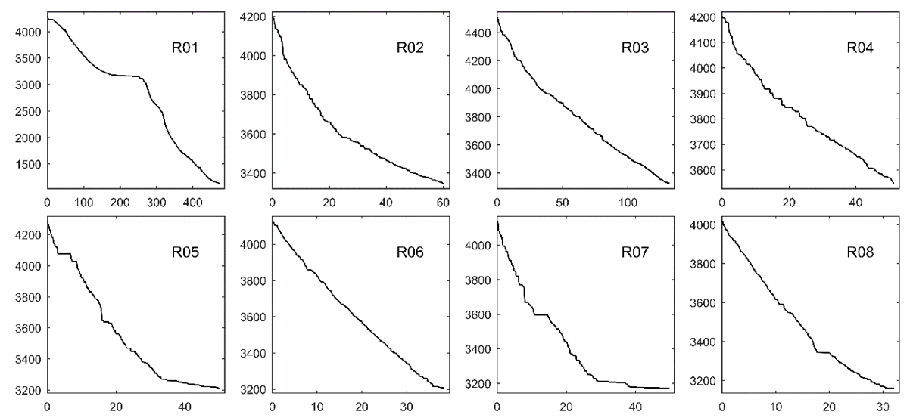
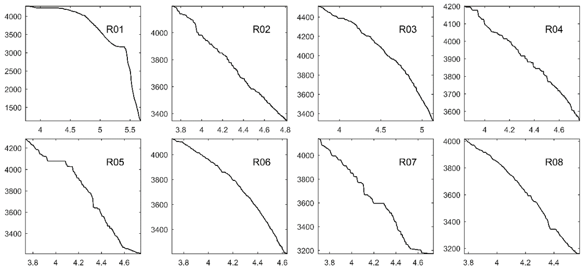
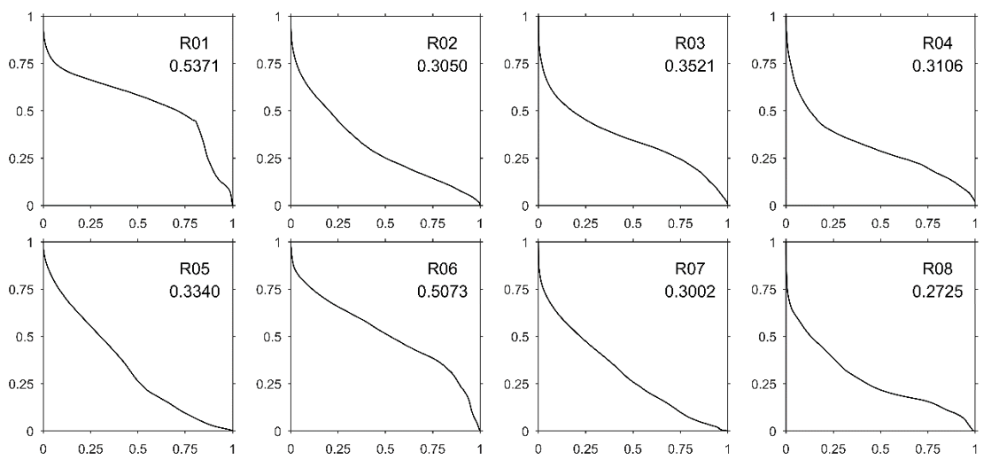

**摘要：** 用ArcGIS和MATLAB提取河流纵剖面、Hack剖面、地貌指数、测高积分、河长坡降指数SL等地貌指数。

<!-- more -->
## 前言

本科，跟着王先彦教授做大创项目和本科毕业论文，题目是"党河流域地貌特征的定量表达及其对新构造活动的指示"，其中，难度最大的是地貌指数的提取。这里，介绍如何提取河流纵剖面、Hack剖面、地貌指数、测高积分、河长坡降指数SL等地貌指数。  
PS：提取陡峭指数和凹曲指数，请使用Geomorphologytools插件，用本文方法无法提取。  

## 资源获取途径

地貌指数提取教程  
包括ArcGIS软件和教程、MATLAB软件和教程、地貌指数提取教程、实验数据（mxd文档、MATLAB代码）。  
百度网盘链接：<https://pan.baidu.com/s/1mAMnz4oQWP8DC4Fvql4iIw>  
提取码：jvxv  

## 成果图展示

### 河流纵剖面

### Hack剖面

### 测高积分图

