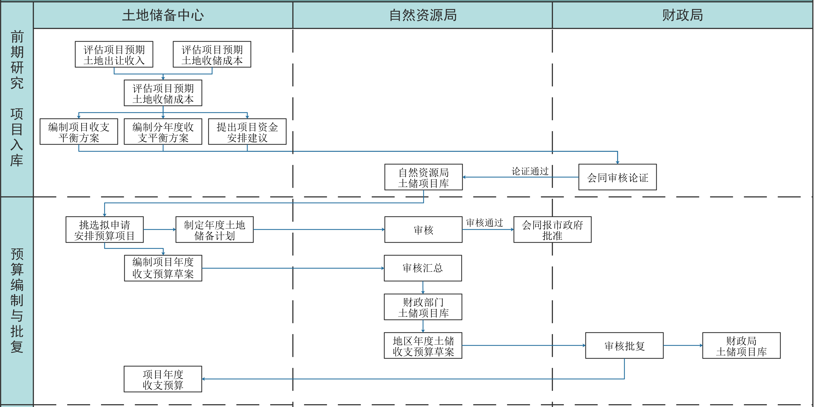

**摘要：** 介绍业务流程图的概念、绘制方法及相关案例。  
<!-- more -->

## 业务流程图介绍

业务流程图，是用来描述业务流程的一种图，通过一些特定的符号和连线来表示具体某个业务的实际处理步骤和过程，详细地描述任务的流程走向，一般没有数据的概念。  

分析业务流程，并将业务流程图表化可以帮助分析者了解业务如何运转，帮助分析者找到业务流程中不合理的流向。现有产品存在的业务流程未必是合理的，通过业务流程图，钻研关键事件的流程，分析为什么要这么做，探索出更深层次的问题，从而对现有不合理的业务流程进行重组优化，进而制定优化方案，改进现有流程。  

产品在写需求文档时主要是对业务规则的描述，而配合以业务流程图可以让业务逻辑更清晰；日常梳理关键事件业务流程时，画出业务流程图可以帮助发现不合理流程，从而对关键事件进行优化。  

在工作中，我们常用到的流程图有：业务流程图、页面流程图和数据流程图。作为产品，经常谈的是业务流程图；作为交互设计师，则比较关心页面流程图；而作为系统分析师，数据流程图最关键。  

## 绘制方法

1.确定有哪些部门和哪些业务环节；  
2.梳理业务环节之间的逻辑，用文字方式记录逻辑关系；  
3.绘制业务流程图，记录业务流程中不太确定的地方，留着讨论；  
4.团队讨论，反复修改，不断优化；  

## Edraw亿图图示

Edraw亿图图示官网<https://www.edrawsoft.cn/>  
国产收费软件，有破解版；  
界面相比于Visio较丑；  
支持绘制流程图、网络拓扑图、平面布置图、组织结构图、工程图等；  
对齐元素非常容易；  
拥有很多预定义模板和案例；  
**EDraw公司抓得紧，这里就不提供破解版了。**  

## 相关案例

  
这是我使用Edraw亿图图示软件绘制的业务流程图（泳道图），对齐容易，画起来很方便。之前一直使用的是Visio，正是因为对齐麻烦才入坑亿图图示；  

**参考资料**  
[产品流程设计：如何绘制业务流程图](https://www.jianshu.com/p/906f04c87124)  
[以美团外卖为例，区别业务流程图和页面流程图](https://www.jianshu.com/p/86ec2abdbfa8)  
