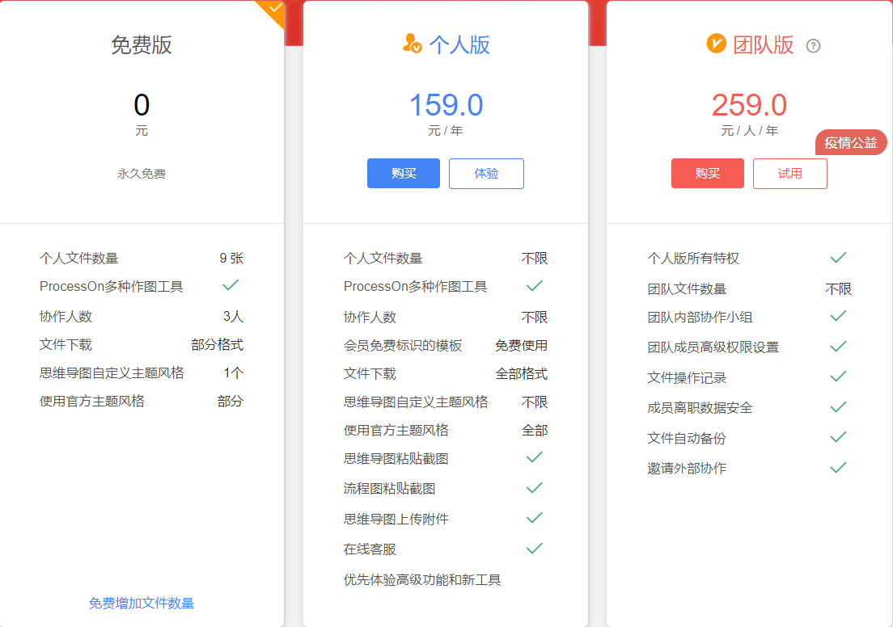
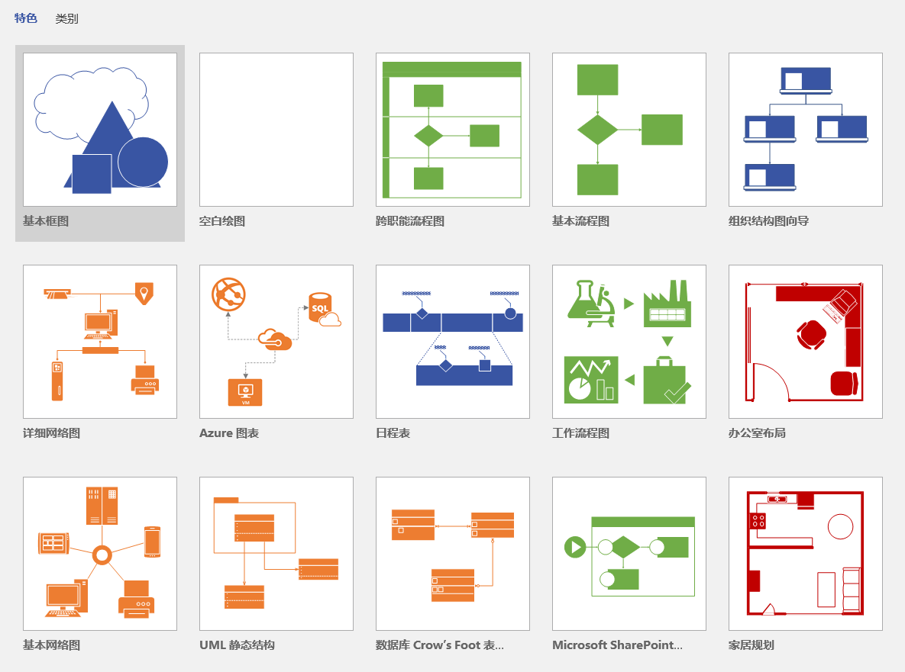
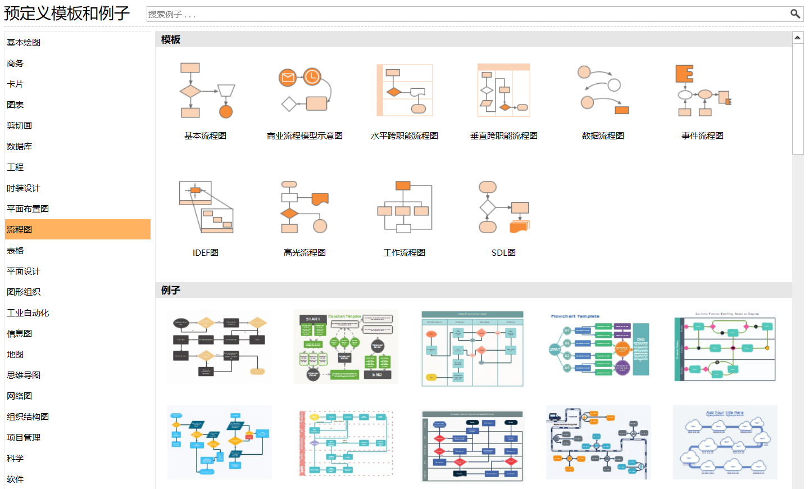

**摘要：** 推荐ProcessOn、draw.io、Visio、Edraw亿图图示等绘图软件。
<!-- more -->
## ProcessOn

ProcessOn网站<https://www.processon.com/>  
免费在线作图、实时团队协作；
拥有海量模板；  
支持流程图、思维导图、原型图、UML、网络拓扑图、组织结构图等；
免费版可以拥有9张个人图表文件，勉强够用；  
  

## draw.io

draw.io网站<https://www.draw.io/>或<https://app.diagrams.net/>  
draw.io是开源软件，每一张图对应的源文件是 XML 格式，通过 XML 能了解每张图的数据结构；  
功能与ProcessOn类似，语言为英文，界面不太美观；
对齐图表元素容易；  
能导出各类图片（比如 png、jpg、svg）和 PDF，同时也能导出 HTML 格式和 VSDX格式（Microsoft Visio 图形格式）。  

## Visio

Visio软件，是office软件系列中的负责绘制流程图和示意图的老牌软件，用户非常多；  
支持绘制流程图、网络拓扑图、平面布置图、组织结构图、工程图等；  
扁平化设计，界面美观；  
对齐元素非常麻烦；  
   

## Edraw

Edraw亿图图示官网<https://www.edrawsoft.cn/>  
国产收费软件，有破解版；  
界面相比于Visio较丑；  
支持绘制流程图、网络拓扑图、平面布置图、组织结构图、工程图等；  
对齐元素非常容易；  
拥有很多预定义模板和案例；  
  

## 个人推荐软件

个人推荐使用Edraw亿图图示，尤其是画业务流程图；拥有很多预定义模板；对齐元素容易；  
之前一直使用的是Visio，正是因为对齐麻烦才入坑亿图图示；  
**EDraw公司抓得紧，这里就不提供破解版了。**  

**参考资料**  
[流程图软件draw.io值得你拥有](https://www.jianshu.com/p/70baaec4cf0f)  
[画流程图，选Visio还是选亿图Edraw](https://www.jianshu.com/p/3ba46a4c8982)  
