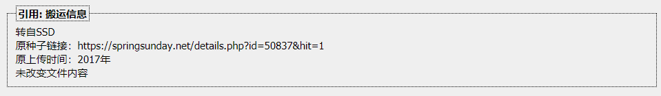
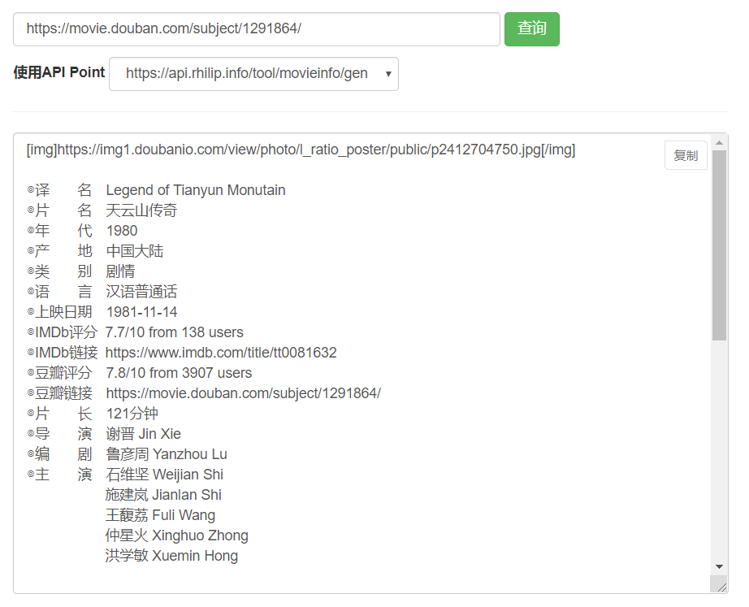
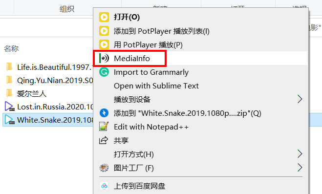
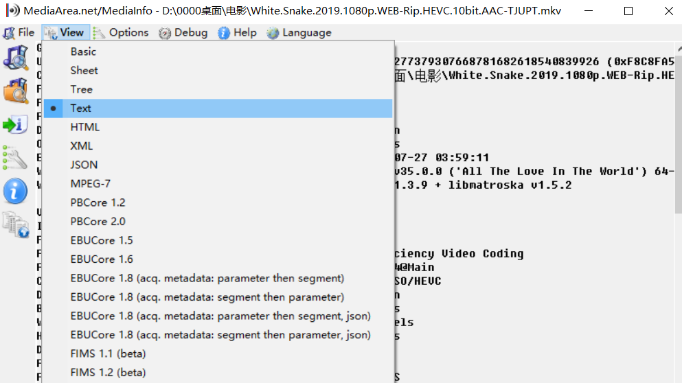
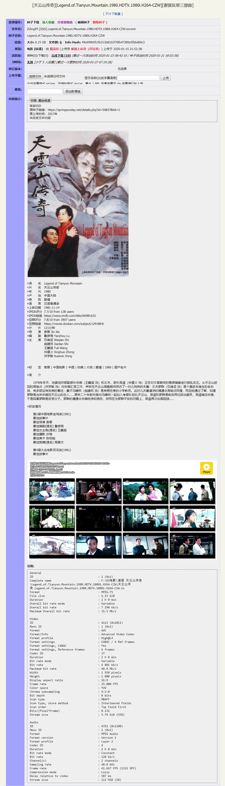

**摘要：** 紫荆PT是南京大学教育网环境下的PT站，站友在上传种子时，需要写种子简介。这里，提供一些入门教程，方便站内快速、高效地写出合格的种子简介。
<!-- more -->
# BBCode 
PT站大多使用的是轻量标记语言BBCode，紫荆PT亦是如此。
常见的BBCode标签代码：
- [紫荆PT-BBCode标签代码示例](http://zijingbt.njuftp.org/faq.html#faq10)  
- [BBCode 标签指南](https://bangumi.tv/help/bbcode)  

**“引用”**

   
代码如下：
```
[quote]转自SSD
原种子链接：https://springsunday.net/details.php?id=50837&hit=1
原上传时间：2017年
未改变文件内容[/quote]
```

**给“引用”添加标题**

   
代码如下：
```
[quote=搬运信息]转自SSD
原种子链接：https://springsunday.net/details.php?id=50837&hit=1
原上传时间：2017年
未改变文件内容[/quote]
```


# 实用工具
## PTGen快速填写电影、剧集的简介
### 简介  
PTGen是由R酱（rhilip）开发的Pt站资源简介生成工具。    
R酱博客：https://blog.rhilip.info/  
R酱Github：https://github.com/Rhilip/  

在填写电影、剧集、综艺类资源的简介时，强烈推荐使用下面这个简介生成模板：  
https://rhilip.github.io/PT-help/ptgen  

  

### 使用方法
1. 输入豆瓣链接、豆瓣ID、IMDB链接、IMDB ID、电影中文名、电影英文名等信息；
2. 获得查询结果；
3. 点击右上角“复制”按钮，复制简介；
4. 粘贴到PT站种子简介处；

参考资料：  
[R酱-Pt站资源简介生成工具PT-Gen](https://blog.rhilip.info/archives/800/)  
[北洋园PT-简介生成模板](https://www.tjupt.org/forums.php?action=viewtopic&topicid=15098&page=p162215#pid162215)（查看需要注册北洋园PT账号）

---  
## PotPlayer截图
### 简介
PotPlayer是Daum公司的一款免费的网络播放器，拥有强大的内置解码器。  
下载链接：
https://daumpotplayer.com/download/
### 使用方法    
截图：  
视频->图像截取->截存当前源画面（快捷键：Alt+E） 

创建缩略图：  
视频->图像截取->创建缩略图（快捷键：Alt+N）  

参考资料：  
[北洋园PT-视频缩略图制作教程](https://www.tjupt.org/forums.php?action=viewtopic&topicid=5980)（查看需要注册北洋园PT账号）  
[紫荆PT-视频缩略图制作方法](http://zijingbt.njuftp.org/faq.html#faq17)  

---  
## MedioInfo填写视频编码信息
### 简介
MediaInfo是一款免费、实用的视频参数检测工具，除了可以对视频进行编码分析查询，还可以对音频文件的编码及信息进行检测。  
下载链接：http://mediaarea.net/en/MediaInfo
### 使用方法
1.选中文件，右键用MedioInfo打开；   

  
2.点击View->Text；  


3.全选，复制粘贴到PT站种子简介处；
视频编码信息会出现不对齐的现象，需要括在下述代码内，设置为等宽字体。
```
[font=Consolas,monospace]视频编码信息[/font]
```

参考资料：  
[紫荆PT-视频编码的查询方法](http://zijingbt.njuftp.org/faq.html#faq16)

# 种子简介示例
种子链接：http://zijingbt.njuftp.org/stats.html?id=113159  
种子简介代码如下：  
```
[quote=搬运信息]转自SSD
原种子链接：https://springsunday.net/details.php?id=50837&hit=1
原上传时间：2017年
未改变文件内容[/quote]

[img]http://nvidia.njuftp.org/images/2020/1/15/f824b7f4-326f-4f5b-8061-281e3b7830da.jpg[/img]

◎译　　名　Legend of Tianyun Monutain
◎片　　名　天云山传奇
◎年　　代　1980
◎产　　地　中国大陆
◎类　　别　剧情
◎语　　言　汉语普通话
◎上映日期　1981-11-14
◎IMDb评分  7.7/10 from 138 users
◎IMDb链接  https://www.imdb.com/title/tt0081632
◎豆瓣评分　7.8/10 from 3907 users
◎豆瓣链接　https://movie.douban.com/subject/1291864/
◎片　　长　121分钟
◎导　　演　谢晋 Jin Xie
◎编　　剧　鲁彦周 Yanzhou Lu
◎主　　演　石维坚 Weijian Shi
　　　　　  施建岚 Jianlan Shi
　　　　　  王馥荔 Fuli Wang
　　　　　  仲星火 Xinghuo Zhong
　　　　　  洪学敏 Xuemin Hong


◎标　　签　谢晋 | 中国电影 | 中国 | 伤痕 | 大陆 | 爱情 | 1980 | 国产老片

◎简　　介  

　　1978年冬天，地委组织部副部长宋薇（王馥荔 饰）和丈夫、部长吴遥（仲星火 饰）正在对文革期间的冤假错案进行拨乱反正。从天云山赶回的周瑜贞（洪学敏 饰）向宋薇汇报工作，声称在天云山调查期间拜访了一对儿特殊的夫妻：丈夫罗群（石维坚 饰）是个靠赶车维生的老右派，有多部没有发表的著述；妻子冯晴岚（施建岚 饰）是有病在身的小学教员。这对儿夫妻凄凉的境遇令周瑜贞同情，而且她通过了解，知道罗群是当年宋薇在天云山的恋人……原来二十年前宋薇与冯晴岚一起加入考察队驻扎天云山，吴遥和罗群是前后两任政治委员，吴遥暗恋宋薇，于是陷害罗群是反党分子。罗群的遭遇令宋薇吃惊和愤怒，然而在为罗群平反的问题上，吴遥再次出面阻挠……

◎获奖情况  

　　第1届中国电影金鸡奖(1981)
　　最佳故事片
　　最佳导演 谢晋
　　最佳编剧(提名) 鲁彦周
　　最佳女主角(提名) 王馥荔
　　最佳摄影 许琦
　　最佳美术 陈绍勉
　　最佳剪辑(提名) 周鼎文

　　第4届大众电影百花奖(1981)
　　最佳故事片

[img]http://nvidia.njuftp.org/images/2020/1/15/49004b27-e3eb-41d5-9c34-993e103373ec.jpg[/img]

[quote][font=Consolas,monospace]General
ID                                       : 1 (0x1)
Complete name                            : F:\03电影\谢晋 天云山传奇\Legend.of.Tianyun.Mountain.1980.HDTV.1080i.H264-CZW\天云山传奇.Legend.of.Tianyun.Mountain.1980.HDTV.1080i.H264-CZW.ts
Format                                   : MPEG-TS
File size                                : 6.15 GiB
Duration                                 : 2 h 0 min
Overall bit rate mode                    : Variable
Overall bit rate                         : 7 290 kb/s
Maximum Overall bit rate                 : 35.5 Mb/s

Video
ID                                       : 4113 (0x1011)
Menu ID                                  : 1 (0x1)
Format                                   : AVC
Format/Info                              : Advanced Video Codec
Format profile                           : High@L4
Format settings                          : CABAC / 4 Ref Frames
Format settings, CABAC                   : Yes
Format settings, Reference frames        : 4 frames
Codec ID                                 : 27
Duration                                 : 2 h 0 min
Bit rate mode                            : Variable
Bit rate                                 : 6 801 kb/s
Maximum bit rate                         : 40.0 Mb/s
Width                                    : 1 920 pixels
Height                                   : 1 080 pixels
Display aspect ratio                     : 16:9
Frame rate                               : 25.000 FPS
Color space                              : YUV
Chroma subsampling                       : 4:2:0
Bit depth                                : 8 bits
Scan type                                : MBAFF
Scan type, store method                  : Interleaved fields
Scan order                               : Top Field First
Bits/(Pixel*Frame)                       : 0.131
Stream size                              : 5.74 GiB (93%)

Audio
ID                                       : 4352 (0x1100)
Menu ID                                  : 1 (0x1)
Format                                   : MPEG Audio
Format version                           : Version 1
Format profile                           : Layer 2
Codec ID                                 : 4
Duration                                 : 2 h 0 min
Bit rate mode                            : Constant
Bit rate                                 : 128 kb/s
Channel(s)                               : 2 channels
Sampling rate                            : 48.0 kHz
Frame rate                               : 41.667 FPS (1152 SPF)
Compression mode                         : Lossy
Delay relative to video                  : 587 ms
Stream size                              : 111 MiB (2%)[/font][/quote]
```

种子简介截图：  


# 参考资料
[【新手手册】初入北洋园PT你必须知道的知识](https://www.tjupt.org/forums.php?action=viewtopic&forumid=15&topicid=15075)：超级详细的PT站入门教程（需要注册北洋园PT账号）  
[发布资源&制作种子的教程](https://www.tjupt.org/forums.php?action=viewtopic&topicid=15098)：发布资源&制作种子的教程（需要注册北洋园PT账号）    


